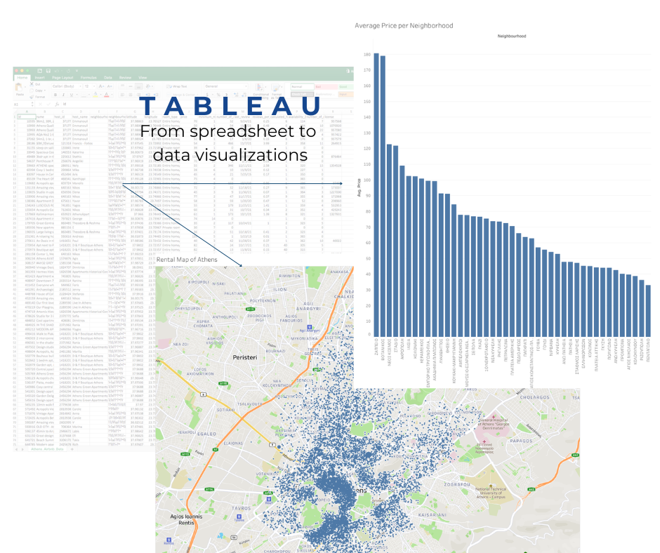
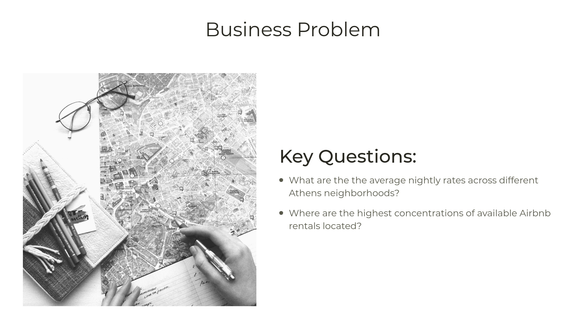
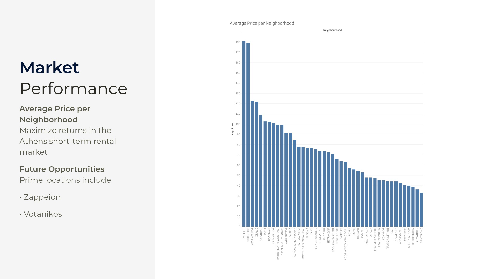
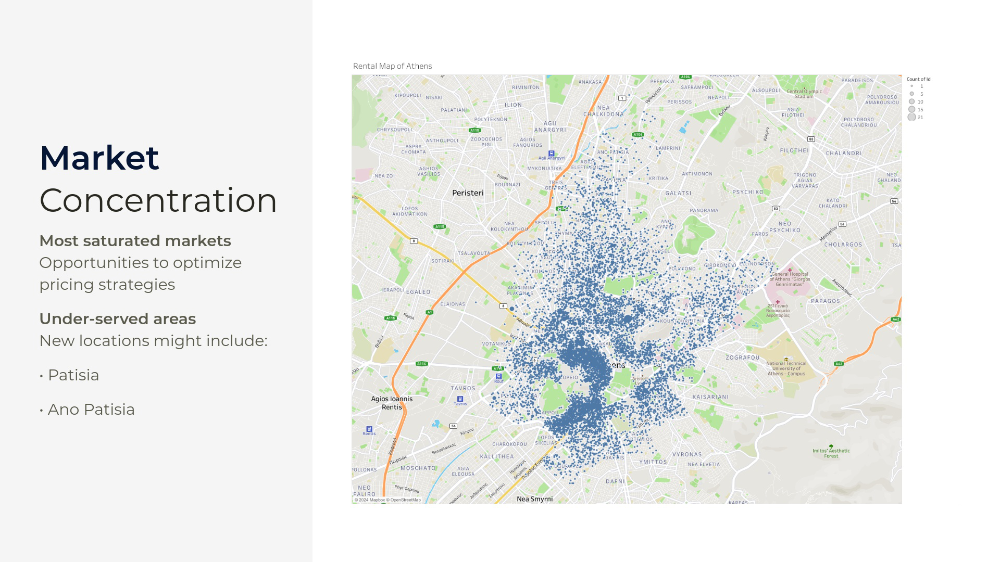
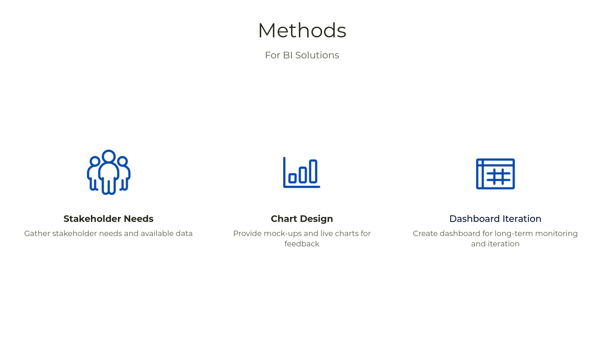
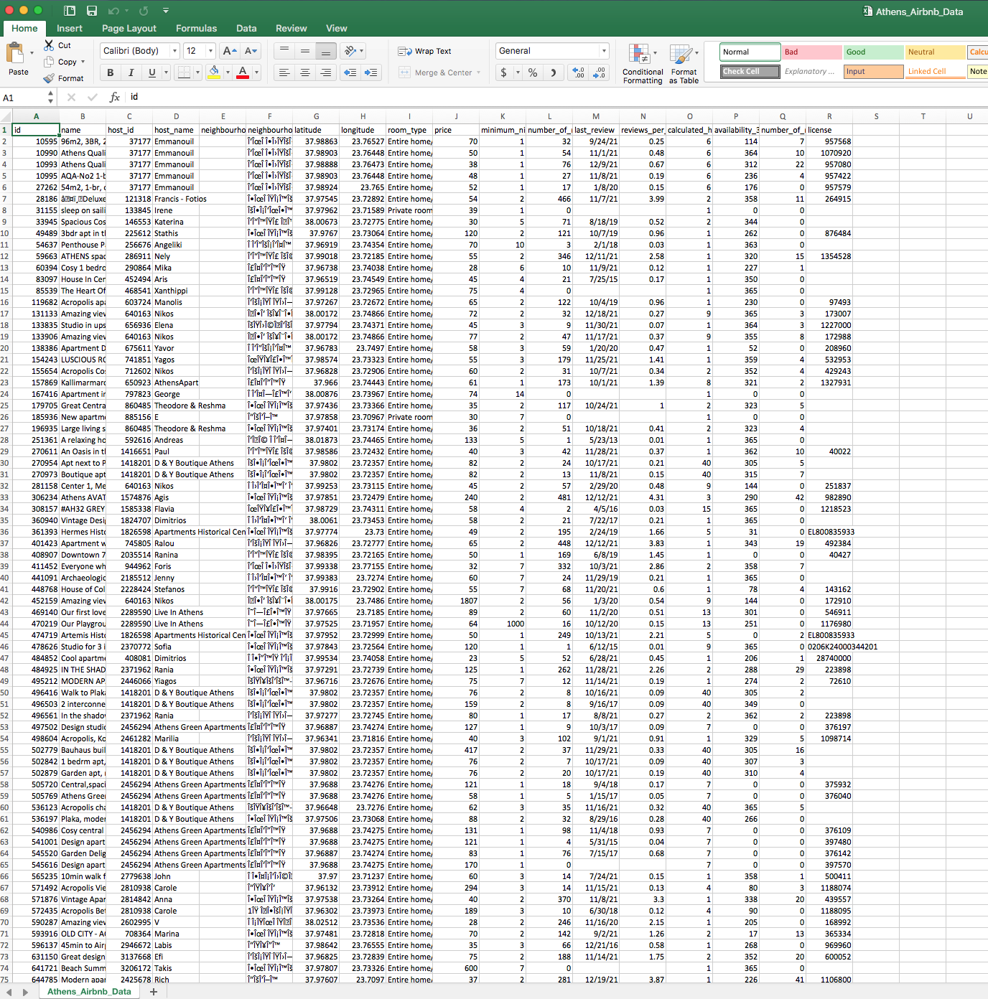
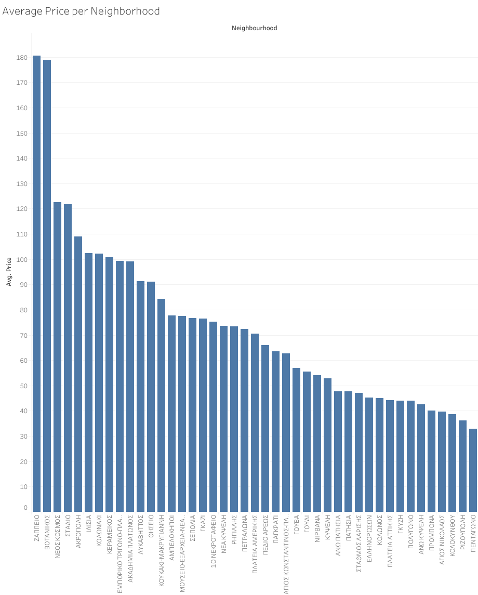
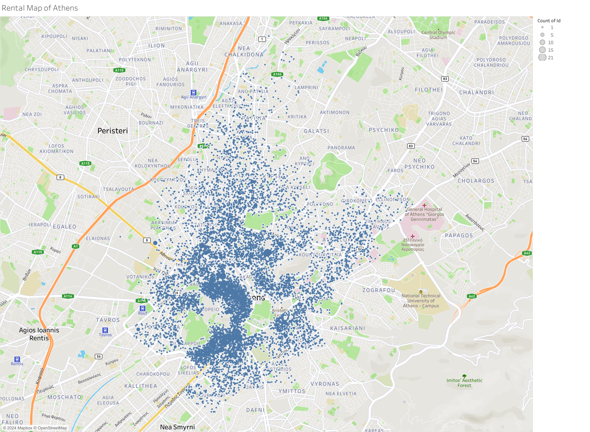
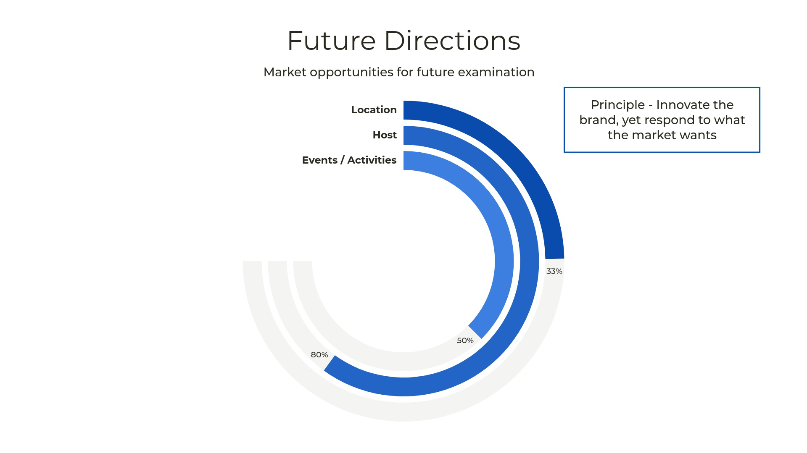
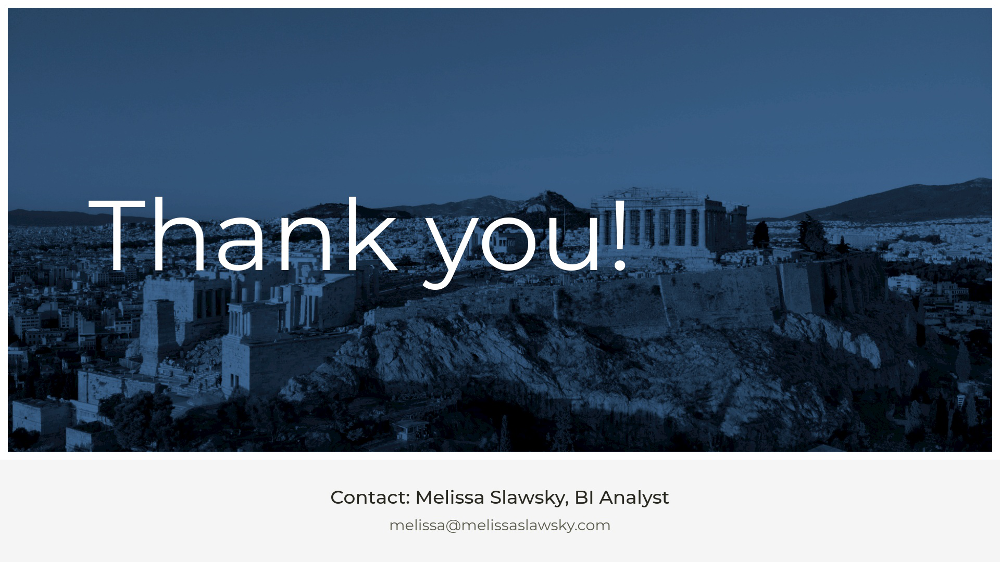

# Market Analysis - Airbnb Athens

**Comprehensive Market Analysis for Strategic Decision-Making**  
This project conducts an in-depth analysis of Airbnb listings in Athens, transforming raw data from multiple spreadsheets into interactive Tableau visualizations. It provides strategic insights for stakeholders in the travel and hospitality industry.

### [Live Visualizations](https://public.tableau.com/views/MarketAnalysis-AthensAirbnb/AveragePriceperNeighborhood?:language=en-US&:sid=&:redirect=auth&:display_count=n&:origin=viz_share_link)

---

## Business Problem

---

## Executive Summary & Key Findings

  
**[Full Presentation](https://www.beautiful.ai/player/-OCExbG8aww0lcAnqo3P)**

---

### Strategic Insights

This analysis highlights critical trends and opportunities in the Athens Airbnb market:

1. **Pricing Trends Across Neighborhoods**
   - Identified significant pricing variations across key neighborhoods.  
   - Neighborhoods with average prices above market median are flagged as potential premium market opportunities.
  

2. **Geographical Concentrations**
   - High-density rental areas are mapped to identify underserved neighborhoods.  
   - Strategic growth opportunities exist in less saturated zones.

3. **Market Segmentation**
   - Detailed segmentation enables stakeholders to align offerings with customer preferences, enhancing competitiveness.

### Business Impact

- **Data-Driven Decisions:** Supports pricing optimization and competitive positioning.  
- **Growth Strategies:** Helps identify new market opportunities and improve resource allocation.  
- **Stakeholder Alignment:** Provides a clear framework for strategic planning.

---

## Project Documentation

### Business Intelligence Documents

- [Strategy Document](https://github.com/yourusername/market-analysis-airbnb-athens/raw/main/strategy-doc-airbnb-athens.pdf) (PDF)  
- [Stakeholder Requirements](https://github.com/yourusername/market-analysis-airbnb-athens/raw/main/stakeholder-requirements-airbnb-athens.pdf) (PDF)  
- [Project Requirements](https://github.com/yourusername/market-analysis-airbnb-athens/raw/main/project-requirements-airbnb-athens.pdf) (PDF)  
- [Dashboard Mockup](https://github.com/yourusername/market-analysis-airbnb-athens/raw/main/dashboard-mockup.pdf) (PDF) 

### Data Methods

📂 **Data Files**  
- [Airbnb Data - Athens](https://github.com/yourusername/market-analysis-airbnb-athens/blob/main/athens-airbnb-data.csv)

---

## Dashboard Development

1. **Data Integration & Cleaning**
   - Aggregated data from multiple spreadsheets.  
   - Standardized formats and validated for consistency.

2. **Visualization Methods**
   - **Average Price Per Neighborhood**: Vertical bar chart highlighting pricing trends.  
       
   - **Athens Rental Map**: Geographical distribution of rental properties.  
     

3. **Insights Presentation**
   - Interactive Tableau dashboards tailored for stakeholder engagement.

### Implementation Recommendations

1. **Pricing Strategy**
   - Adjust pricing models based on neighborhood insights.

2. **Market Expansion**
   - Explore underserved neighborhoods for potential growth.

3. **Targeted Marketing**
   - Leverage segmentation data to create personalized marketing campaigns.
  

  

  
   

---

## Contact

For inquiries about this analysis:  
- [LinkedIn Profile](https://www.linkedin.com/in/melissaslawsky/)  
- [Professional Website](https://melissaslawsky.com/client-results/)  
- [Tableau Portfolio](https://public.tableau.com/app/profile/melissa.slawsky1925/vizzes)  
- [Email](mailto:melissa@melissaslawsky.com)

---

© Melissa Slawsky 2024. All Rights Reserved.  
This repository contains proprietary analysis.

**Published Project URL**: [Market Analysis - Airbnb Athens](https://public.tableau.com/views/MarketAnalysis-AthensAirbnb/AveragePriceperNeighborhood?:language=en-US&:sid=&:redirect=auth&:display_count=n&:origin=viz_share_link)
